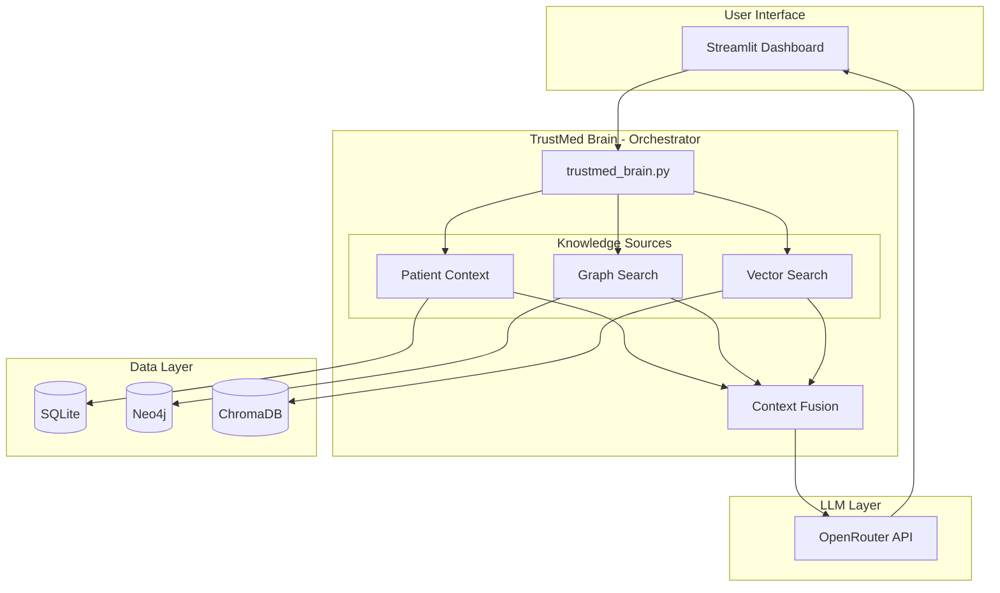
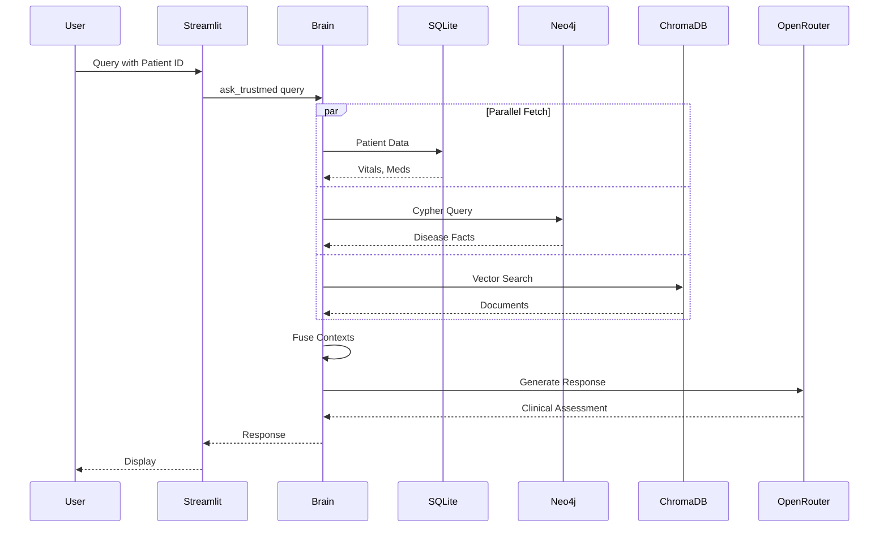
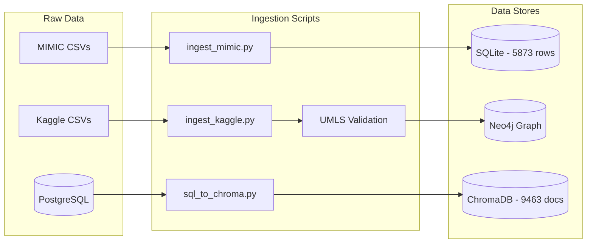

# TrustMed AI - System Architecture

## High-Level Architecture

---

## Data Flow Diagram

---

## Data Ingestion Pipeline

---

## Component Summary

| Component | Technology | Files |
|-----------|------------|-------|
| UI | Streamlit | `app.py` |
| Orchestrator | Python/asyncio | `src/trustmed_brain.py` |
| Patient Data | SQLite | `src/patient_context_tool.py` |
| Graph Search | Neo4j/Cypher | `src/graph_tool.py` |
| Vector Search | ChromaDB | `src/hybrid_search.py` |
| LLM | OpenRouter | nvidia/nemotron |

---

## Query Processing Steps

1. **User Input** → Streamlit captures query
2. **Patient Detection** → Regex finds patient ID (10XXXXXX)
3. **Parallel Fetch**:
   - SQLite: vitals, diagnoses, medications
   - Neo4j: disease facts, symptoms, precautions
   - ChromaDB: relevant medical documents
4. **Context Fusion** → Combine all three contexts
5. **LLM Synthesis** → Generate clinical assessment
6. **Response** → Display in chat interface
