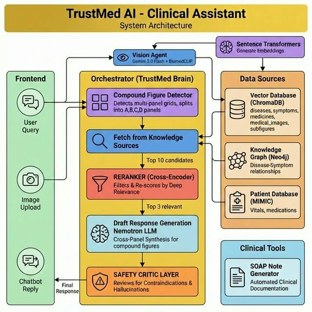

# TrustMed AI

TrustMed AI is a multimodal clinical decision support system built around a FastAPI backend and a React/Vite frontend. It combines patient context, a medical knowledge graph, medical literature retrieval, and medical image analysis into a single application with two current product surfaces:

- `Clinician dashboard` at `/clinician`
- `Patient portal` at `/patient`

The current primary app is the `FastAPI + React` stack. The older `Streamlit` app still exists in the repo as a legacy path, but it is not the main interface documented here.



## Current Product Surface

### Clinician dashboard
- Streaming chat with multi-session history
- Text and vision model selection
- Temperature control
- Patient-aware context loading from the MIMIC demo database
- Image upload and multimodal analysis
- Compound figure detection and per-panel analysis
- Context-aware knowledge graph tab
- Drug alert tab
- SOAP note generation

### Patient portal
- Separate patient-facing workflow at `/patient`
- Profile, vitals, medications, imaging, and care-plan tabs
- Patient-friendly assistant constrained to visit/chart questions
- Personalized care-plan summary from current chart data
- Vitals trend cards with hover tooltips
- Medication interaction checks in plain language

## Runtime Architecture

### Frontend
- `React 19`
- `Vite 7`
- `React Router`
- `react-force-graph-2d`
- `react-markdown`

### Backend
- `FastAPI`
- Server-sent event streaming for chat responses
- Local session persistence in `chat_history/`
- Uploaded file handling in `uploads/`

### Clinical / AI stack
- `LangChain` orchestration
- `OpenRouter` text generation
- `Vertex AI MedGemma` support for text/vision flows
- `ChromaDB` for retrieval
- `Neo4j` for the knowledge graph
- `Sentence Transformers` reranking/retrieval support
- `BiomedCLIP`-style image retrieval pipeline in the vision path
- `MIMIC demo SQLite` patient context in `data/mimic_demo.db`

## Repo Layout

```text
TrustMed-AI/
├── api/
│   └── main.py                    # FastAPI app and API routes
├── frontend/
│   ├── src/pages/
│   │   ├── ClinicianDashboard.jsx
│   │   ├── PatientPortal.jsx
│   │   └── RoleSelector.jsx
│   ├── src/components/
│   │   ├── KnowledgeGraphPanel.jsx
│   │   ├── PatientInfoPanel.jsx
│   │   ├── SOAPNoteModal.jsx
│   │   └── VitalTrendChart.jsx
│   └── vite.config.js
├── src/
│   ├── trustmed_brain.py          # Main orchestration logic
│   ├── patient_context_tool.py    # MIMIC demo patient data access
│   ├── graph_visualizer.py        # Neo4j graph JSON generation
│   ├── vision_agent.py            # Vision + retrieval pipeline
│   ├── vision_tool.py             # Vision model integration
│   └── subfigure_detector.py      # Compound figure detection
├── data/
│   ├── mimic_demo.db              # Demo patient database
│   ├── chroma_db/                 # Retrieval store
│   └── medical_images/            # Image corpus
├── chat_history/                  # Saved chat sessions
├── uploads/                       # Uploaded images and split panels
├── docs/
│   ├── README.md                  # This file
│   ├── ARCHITECTURE.md
│   └── README_KNOWLEDGE_GRAPH.md
├── run_dev.sh                     # Starts backend + frontend together
└── app.py                         # Legacy Streamlit UI
```

## Current Routes

### Frontend routes
- `/` role selector
- `/clinician` clinician dashboard
- `/patient` patient portal

### Core backend routes
- `POST /chat/stream` streaming chat
- `POST /chat` non-streaming chat
- `POST /upload-image` image upload
- `POST /soap-note` SOAP note generation
- `GET /patient/{patient_id}` patient data
- `POST /patient/{patient_id}/summary` patient-facing summary
- `GET /graph` graph data for the right panel
- `GET /sessions` list saved sessions
- `POST /sessions/new` create a session
- `DELETE /sessions/{session_id}` delete a session
- `POST /sessions/rename` rename a session
- `POST /detect-panels` compound figure detection
- `GET /panels/{filename}` serve generated panel images
- `GET /explain-term` medical term explanation

## Local Development

### 1. Backend dependencies
```bash
pip install -r requirements.txt
```

### 2. Frontend dependencies
```bash
cd frontend
npm install
cd ..
```

### 3. Environment
Create a `.env` file in the project root. Current runtime expects these values:

Required for core LLM responses:
- `OPENROUTER_API_KEY`

Required for knowledge graph features:
- `NEO4J_URI`
- `NEO4J_USERNAME`
- `NEO4J_PASSWORD`

Optional for Vertex / MedGemma flows:
- `VERTEX_PROJECT_ID`
- `VERTEX_ENDPOINT_ID`
- `VERTEX_REGION`
- `VERTEX_SERVICE_ACCOUNT_JSON`
- `VERTEX_DEDICATED_DOMAIN`

Optional:
- `OPENROUTER_MODEL`
- `SAFETY_CRITIC_MODEL`
- `UMLS_API_KEY`

### 4. Run the app
Preferred local dev path:
```bash
./run_dev.sh
```

That starts:
- frontend on `http://localhost:5173`
- backend on `http://localhost:8000`
- API docs on `http://localhost:8000/docs`

### 5. Run manually
Backend:
```bash
cd api
python3 -m uvicorn main:app --reload --port 8000
```

Frontend:
```bash
cd frontend
npm run dev
```

## Frontend / Backend Integration

The frontend uses Vite proxying in `frontend/vite.config.js`:
- browser requests go to `/api/...`
- Vite proxies them to `http://localhost:8000`

That means local frontend code should call API routes through `/api` rather than hard-coding the backend host.

## Data Currently Used

### Patient data
- Demo patient data comes from `data/mimic_demo.db`
- The patient portal and clinician patient context use this database for:
  - latest vitals
  - vitals history
  - diagnoses
  - medications

### Retrieval / graph
- Vector retrieval store lives in `data/chroma_db/`
- Graph queries are backed by Neo4j through `src/graph_visualizer.py`

### Files generated at runtime
- chat sessions: `chat_history/`
- uploaded images: `uploads/`
- split panel images: `uploads/panels/`

## Notes on Legacy Code

These files still exist but are not the primary current product path:
- `app.py` legacy Streamlit UI
- Streamlit dependencies in `requirements.txt`
- older docs that still mention Streamlit where not yet updated

If you continue cleanup, remove those only together with their remaining docs/dependency references.

## What To Update Next

The README is now aligned to the current app entrypoints and stack, but these repo-level follow-ups are still worth doing:
- remove or archive the legacy Streamlit path if it is no longer needed
- tighten backend auth/CORS before any external deployment
- split the frontend bundle to reduce the large Vite build warning
- update the other docs in `docs/` so they match the FastAPI + React architecture
